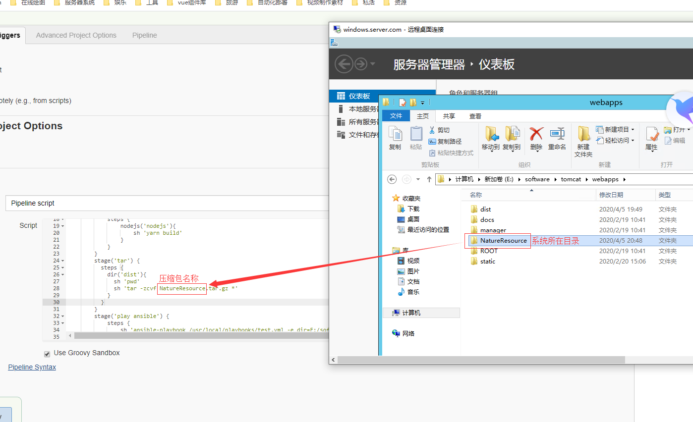

# pipline+ansible实现前端自动化部署

## pipline脚本参考

### 完整代码如下
```
pipeline {
    stages {
        stage('pullcode'){
            steps{
                git branch: 'dev', credentialsId: '70a54454-c8a3-43c1-ada0-91d4a79dd1a4', url: 'http://elb-791125809.cn-northwest-1.elb.amazonaws.com.cn:5335/xdata/SH2019GH080/front-end/ZheJNaturalResources.git'
            }
        }

        stage('install') {
            steps {
                sh 'yarn install'
            }
        }
          stage('build'){
            steps {
                sh 'yarn build'               
            }
        }
        stage('tar') {
          steps {
            dir('dist'){
              sh 'pwd'
              sh 'tar -zcvf NatureResource.tar.gz *'
            }
          }
        }

        stage('play ansible') {
            steps {
                sh 'ansible-playbook /usr/local/playbooks/test.yml -e dir=E:/software/tomcat/webapps/ -e dir2=NatureResource -e dir3=/var/lib/jenkins/workspace/ansible-test/dist/'
            }
        }
    }
}
```
### 获取最新分支代码

```
stage('pullcode'){
    steps{
        git branch: 'dev', credentialsId: '70a54454-c8a3-43c1-ada0-91d4a79dd1a4', url: 'http://elb-791125809.cn-northwest-1.elb.amazonaws.com.cn:5335/xdata/SH2019GH080/front-end/ZheJNaturalResources.git'
    }
}
```
```git branch```:获取指定分支的代码。

```credentialsId```: jenkins配置gitlab用户的全局凭证id。

```git```: git仓库地址。


::: warning 注意
jenkins所在服务器必须全局安装了ansible，nodejs等环境以及将yarn，ansible-playbook命令配置到全局
:::

### 前端项目的打包

```
stage('install') {
    steps {
        sh 'yarn install'
    }
}
stage('build'){
    steps {
        sh 'yarn build'               
    }
}
```

### 将打包好的系统进行压缩
```
stage('tar') {
    steps {
        dir('dist'){
            sh 'pwd'
            sh 'tar -zcvf NatureResource.tar.gz *'
        }
    }
}
```

### 将系统通过ansible发布到远程服务器上

```
stage('play ansible') {
    steps {
        sh 'ansible-playbook /usr/local/playbooks/test.yml -e dir=E:/software/tomcat/webapps/ -e dir2=NatureResource -e dir3=/var/lib/jenkins/workspace/ansible-test/dist/'
    }
}
```

```ansible-playbook /usr/local/playbooks/test.yml```: ansible-playbook执行预先编写好的yml脚本。

- 以下均为给执行的ansible脚本传的参数-e命令代表后面接的是参数

```-e dir=E:/software/tomcat/webapps/```: 远程服务器tomcat所在目录

```-e dir2=NatureResource```: 前端系统所在文件夹
::: warning 注意
为了避免重复编写脚本，目前我默认将远程服务器系统根目录的文件名和压缩包名进行统一。
<div align=center>
	
</div>
:::

```-e dir3=/var/lib/jenkins/workspace/ansible-test/dist/```: 压缩包所在路径

## ansible脚本参考


### 全部脚本参考

```
- hosts: wind3
  remote_user: administrator
  tasks:
    - name: send file
      win_copy: src={{dir3}}{{dir2}}.tar.gz dest={{dir}}
    - name: delete old file
      win_file: path={{dir}}{{dir2}} state=absent
    - name: make new dir
      win_file: path={{dir}}{{dir2}} state=directory
    - name: move file
      win_shell: move {{dir}}{{dir2}}.tar.gz {{dir}}{{dir2}}/
    - name: tar .tar.gz
      win_shell: 7z x {{dir}}{{dir2}}/{{dir2}}.tar.gz -o{{dir}}{{dir2}}/
    - name: tar .tar
      win_shell: 7z x {{dir}}{{dir2}}/{{dir2}}.tar -o{{dir}}{{dir2}}/
    - name: delete old file
      win_file: path={{dir}}{{dir2}}/static state=absent
    - name: copy config
      win_copy: src={{dir}}static dest={{dir}}{{dir2}}/ remote_src=true
```