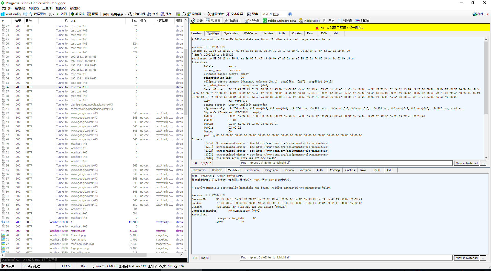
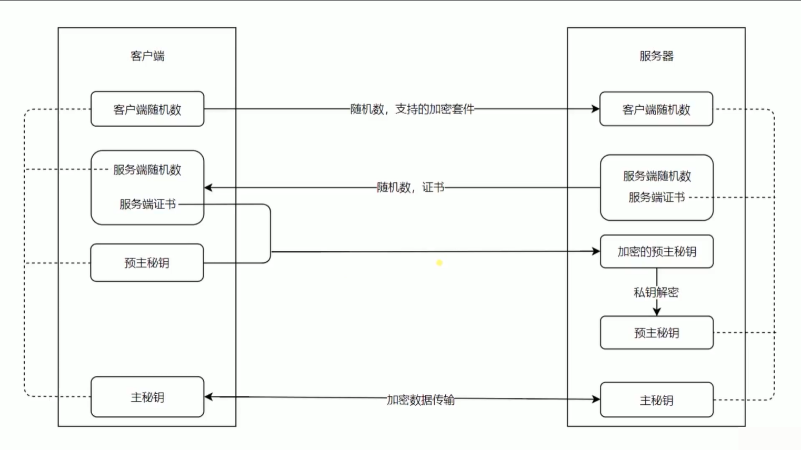

# https 的安全机制

## 概要

https 作为安全的 http 协议，已经越来受各大互联网公司欢迎，逐渐成为网页开发的主流。https 是什么？为什么 https 是安全的？https 安全的原理是是什么？今天就跟大家分享一下我对这三个问题的理解。

- [1 https 是什么](#)
- [2 为什么 https 是安全的](#)
- [3 https 的加密通信原理](#)

## https 是什么

https 是 http+Secure，全称：Hyper Text Transfer Protocol over Secure Socket Layer 超文本安全传输协议。是以安全为目标的 HTTP 通道，简单讲是 HTTP 的安全版。

## 为什么 https 是安全的

https 中引入了公钥和私钥，公钥是在互联网环境下对传输内容进行加密的字符串，互联网环境下都可以拿到。而私钥只存在于服务器上。http 传输的内容只有
通过公钥和私钥解密才能获取，中间层由于没有私钥所以无法解析传输的内容。
抓包工具获取的 http1.1 链接，由于 http1.1 使用的是明文传输所有信息抓包工具均可以获取。

而抓包工具获取的 https 的请求由于没有私钥只能获取一些加密的信息

## https 的加密通信原理

那客户端和服务端之间做了哪些工作能够实现彼此信息的安全传输的，具体过程如下图所示：

客户端生成随机数，称为随机数 1，并将随机数 1 和客户端支持的加密套件发送给服务端。服务端拿到客户端的随机数 1 之后保存下来，同时生成自己的随机数 2 并伴随着证书（公钥）传输给客户端。客户端拿到了服务端生成的随机数 2 之后也会将其保存下来，并和服务端传送过来的证书（公钥）生成预主秘钥同时还会生成一个随机数 3 ，该随机数会经过预主秘钥进行加密并传送给服务端。服务器拿到加密的预主秘钥后，通过私钥解析，因为只有服务端和客户端有私钥所以中间过程不可能被中间层解析。最终客户端和服务端都会具备三个随机数，并将这三个随机数通过算法和加密套件进行加密生成客户端与服务端之间通信所使用的主密钥。之后客户端与服务端之间的信息传输都将通过主密钥进行传输。
